# Курсовая работа. Автономная навигация мобильного робота в среде Gazebo с использованием ROS 2 и Nav2

## Оглавление

- [Введение](#введение)
- [Инструкции по сборке и запуску Docker-контейнера](#инструкции-по-сборке-и-запуску-docker-контейнера)
- [Основная часть](#основная-часть)
    - [Характеристики робота и датчиков](#характеристики-робота-и-датчиков)
    - [Запуск симуляции](#запуск-симуляции)
    - [Картографирование с помощью SLAM Toolbox](#картографирование-с-помощью-slam-toolbox)
    - [Использование Nav2 с bcr_bot](#использование-nav2-с-bcr_bot)
    - [Добавление скрипта для публикации координат целевой точки](#добавление-скрипта-для-публикации-координат-целевой-точки)
    - [Экперимент](#эксперимент)
        - [Постановка эксперимента](#постановка-эксперимента)
        - [Порядок проведения эксперимента](#порядок-проведения-эксперимента)
        - [Результаты эксперимента и выводы](#результаты-эксперимента-и-выводы)
- [Заключение](#заключение)
- [Благодаронсти](#благодарности)
- [Список литературы](#список-литературы)


## Введение
Автономная навигация — ключевая задача робототехники. Данная курсовая работа посвящена изучению и запуску готового проекта навигации робота bcr_bot с использованием ROS 2 и Nav2 в симулированной среде. 

Благодаря фреймворку ROS2 и навигационному стеку Nav2 разработчки могут создавать алгоритмы для задач локализации, построения карт и планирования траекторий в условиях сложных и динамически меняющихся сред. Интеграция симуляционных платформ, таких как Gazebo, и инструментария SLAM Toolbox позволяет проводить тестирование и оптимизацию алгоритмов навигации без привлечения физических прототипов, что существенно снижает барьеры для проведения исследований.

Цель данной работы — освоить локализацию (AMCL), планирование пути и работу с сенсорами (лидар, IMU, Kinect)в ROS2 и Gazebo. Проект основан на репозитории [bcr_bot](<https://github.com/blackcoffeerobotics/bcr_bot>). 

## Инструкции по сборке и запуску Docker-контейнера
Для сборки Docker-образа необходимо выполнить bash-скрипт:

```bash
bash build_docker.sh 
```

Запуск контейнера:

```bash
bash run_docker.sh 
```

Открытие еще одного терминала Docker-контейнера:
```bash
bash new_terminal.sh
```

## Основная часть
### Характеристики робота и датчиков
Рассматриваемый робот представлен на рисунке ниже.

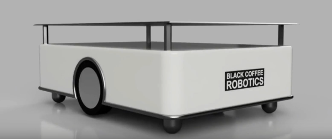

Параметры робота и датчиков прописаны в ```gazebo.xacro``` и в ```bcr_bot.xacro```.

Он состоит из двух тяговых колес (дифференциальная передача) и четырех опорных роликов. Основные характеристики:
- радиус колес: 0.1 м;
- расстояние между колесами: 0.6 м;
- радиус роликов: 0.06 м;
- максимальный крутящий момент двигателей: 20000 Н*м;
- масса робота: 73.51 кг;
- длина корпуса: 0.9 м;
- ширина корпуса: 0.64 м;
- высота корпуса: 0.19 м.

Параметры датчиков:
1. **2D-лидар**
```xml
 <!-- ........................... 2D LIDAR PLUGIN ................................... -->

    <xacro:if value="$(arg two_d_lidar_enabled)">

        <gazebo reference="two_d_lidar">
            <gravity>true</gravity>
            <sensor type="ray" name="two_d_lidar">
                <pose>0 0 0 0 0 0</pose>
                <visualize>false</visualize>
                <update_rate>${two_d_lidar_update_rate}</update_rate>
                <ray>
                    <scan>
                        <horizontal>
                            <samples>${two_d_lidar_sample_size}</samples>
                            <resolution>1</resolution>
                            <min_angle>${radians(two_d_lidar_min_angle)}</min_angle>
                            <max_angle>${radians(two_d_lidar_max_angle)}</max_angle>
                        </horizontal>
                    </scan>
                    <range>
                        <min>${two_d_lidar_min_range}</min>
                        <max>${two_d_lidar_max_range}</max>
                        <resolution>0.01</resolution>
                    </range>
                    <noise>
                        <type>gaussian</type>
                        <mean>0.0</mean>
                        <stddev>0.0</stddev>
                    </noise>
                </ray>
                <plugin name="gazebo_ros_laser" filename="libgazebo_ros_ray_sensor.so">
                    <ros>
                        <remapping>~/out:=$(arg robot_namespace)/scan</remapping>
                    </ros>
                    <output_type>sensor_msgs/LaserScan</output_type>
                    <frame_name>two_d_lidar</frame_name>
                </plugin>
            </sensor>
        </gazebo>
    </xacro:if>
```

Для лидара указывается:
- количество лучей = 361;
- частота = 30 Гц;
- минимальное расстояние = 0.55 м;
- максимальное расстояние = 16 м;
- максимальный угол = 360°;
- минимальный угол = 0°.

2. **Камера глубины**
```xml
    <!-- ........................... CAMERA PLUGIN ................................... -->

    <xacro:if value="$(arg camera_enabled)">
        <gazebo reference="kinect_camera">
            <sensor name="kinect_camera" type="depth">
                <pose> 0 0 0 0 0 0 </pose>
                <visualize>true</visualize>
                <update_rate>30</update_rate>
                <camera>
                    <horizontal_fov>1.089</horizontal_fov>
                    <image>
                        <format>R8G8B8</format>
                        <width>640</width>
                        <height>480</height>
                    </image>
                    <clip>
                        <near>0.05</near>
                        <far>8.0</far>
                    </clip>
                </camera>
                <plugin name="camera_controller" filename="libgazebo_ros_camera.so">
                    <ros>
                        <namespace>$(arg robot_namespace)</namespace>
                    </ros>
                    <frame_name>kinect_camera_optical</frame_name>
                    <min_depth>0.1</min_depth>
                    <max_depth>100</max_depth>
                </plugin>
            </sensor>
        </gazebo>
    </xacro:if>
```
Для камеры глубины указывается:
- частота обновления = 30 Гц;
- размер изображения = 640x480;
- диапазон видимости камеры: near = 0.05 м, far = 8.0 м;
- диапазон работы: min = 0.1 м max = 100 м.

3. **IMU**
```xml
    <!--............................... IMU PLUGIN ..................................... -->

    <gazebo reference="imu_frame">
        <sensor name="imu" type="imu">
            <always_on>true</always_on>
            <update_rate>5</update_rate>
            <plugin name="imu_plugin" filename="libgazebo_ros_imu_sensor.so">
                <ros>
                    <namespace>$(arg robot_namespace)</namespace>
                    <remapping>~/out:=imu</remapping>
                </ros>
            </plugin>
        </sensor>
    </gazebo>
```
для IMU указывается:
- частота: 5 Гц.

4. **Стереокамера**
```xml
    <!-- ...........................STEREO CAMERA PLUGIN ................................... -->

    <xacro:if value="$(arg stereo_camera_enabled)">
        <gazebo reference="stereo_camera">
            <sensor type="multicamera" name="stereo_camera">
                <update_rate>10.0</update_rate>
                <always_on>true</always_on>
                <camera name="left">
                    <pose>0 0 0 0 0 0</pose>
                    <horizontal_fov>1.3962634</horizontal_fov>
                    <image>
                        <width>1024</width>
                        <height>1024</height>
                        <format>R8G8B8</format>
                    </image>
                    <clip>
                        <near>0.3</near>
                        <far>20</far>
                    </clip>
                    <noise>
                        <type>gaussian</type>
                        <mean>0.0</mean>
                        <stddev>0.0</stddev>
                    </noise>
                    <distortion>
                        <k1>0.0</k1>
                        <k2>0.0</k2>
                        <k3>0.0</k3>
                        <p1>0.0</p1>
                        <p2>0.0</p2>
                        <center>0.5 0.5</center>
                    </distortion>
                </camera>

                <camera name="right">
                    <pose>0 -0.12 0 0 0 0</pose>
                    <horizontal_fov>1.3962634</horizontal_fov>
                    <image>
                        <width>1024</width>
                        <height>1024</height>
                        <format>R8G8B8</format>
                    </image>
                    <clip>
                        <near>0.3</near>
                        <far>20</far>
                    </clip>
                    <noise>
                        <type>gaussian</type>
                        <mean>0.0</mean>
                        <stddev>0.0</stddev>
                    </noise>
                    <distortion>
                        <k1>0.0</k1>
                        <k2>0.0</k2>0
                        <k3>0.0</k3>
                        <p1>0.0</p1>
                        <p2>0.0</p2>
                        <center>0.5 0.5</center>
                    </distortion>
                </camera>

                <plugin name="stereo_camera_controller" filename="libgazebo_ros_camera.so">
                    <ros>
                        <namespace>$(arg robot_namespace)</namespace>
                        <argument>image_raw:=image_raw</argument>
                        <argument>camera_info:=camera_info</argument>
                    </ros>
                    <camera_name>stereo_camera</camera_name>
                    <frame_name>stereo_camera_optical</frame_name>
                    <hack_baseline>0.12</hack_baseline>
                </plugin>

            </sensor>
        </gazebo>
    </xacro:if>
```
Для стереокамеры указывается:
- частота обновления изображения: 10 Гц;
- разрешение: 1024x1024;
- дистанция видимости: near = 0.3, far = 20;
- расстояние между камерами: 12 см;
- коэффициенты дисторсии: радиальные коэффициенты: 0,0,0; тангенцальные коэффициенты: 0, 0.


### Запуск симуляции
Для запуска симуляции в Gazebo используется launch-файл ```gazebo.launch.py```. Команда запуска выглядит следующим образом:
```bash
ros2 launch bcr_bot gazebo.launch.py
```
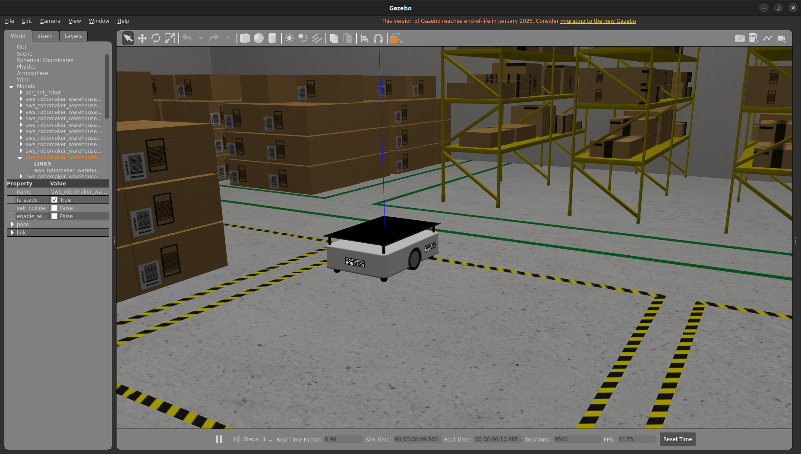

Файл запуска принимает несколько аргументов:
```bash
ros2 launch bcr_bot gazebo.launch.py \
	camera_enabled:=True \
	two_d_lidar_enabled:=True \
	stereo_camera_enabled:=False \
	position_x:=0.0 \
	position_y:=0.0 \
	orientation_yaw:=0.0 \
	odometry_source:=world \
	world_file:=small_warehouse.sdf \
	robot_namespace:="bcr_bot"
```
Описание параметров:
|Параметр|Принимаемый тип|Описание|
|:-|:-:|:-|
|```camera_enabled```       |```bool```  |Включение камеры глубины         |
|```two_d_lidar_enabled```  |```bool```  |Активация 2D лидара              |
|```stereo_camera_enabled```|```bool```  |Включение стереокамеры           |
|```position_x```           |```float``` |Начальная координата x (в метрах)|
|```position_y```           |```float``` |Начальная координата y (в метрах)|
|```orientation_yaw```      |```float``` |Начальный угол поворота (в рад)  |
|```odometry_source```      |```string```|Данные одометрии из симуляции (можно использовать ```encoder```)|
|```world_file```           |```string```|Файл мира Gazebo (располагаются в ```src/bcr_bot/worlds/```)|
|```robot_namespace```      |```string```|Пространство имен для топиков и tf-фреймов|

Для визуализации в RViz используется launch-файл ```rviz.launch.py```

```bash
ros2 launch bcr_bot rviz.launch.py
```
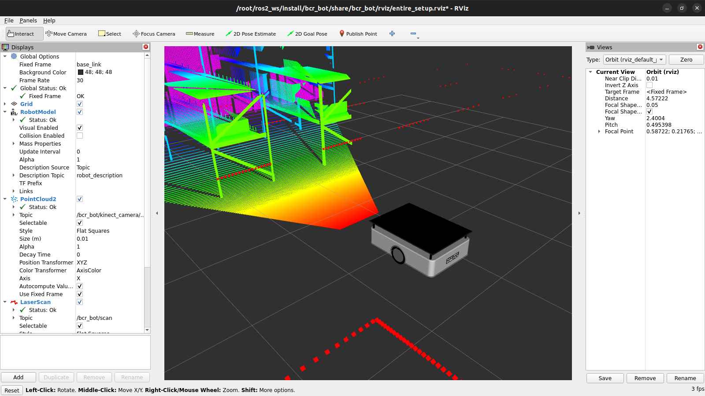

Также можно посмотреть изображения с камеры глубины, добавив в RViz элементы визуализации ```Image```

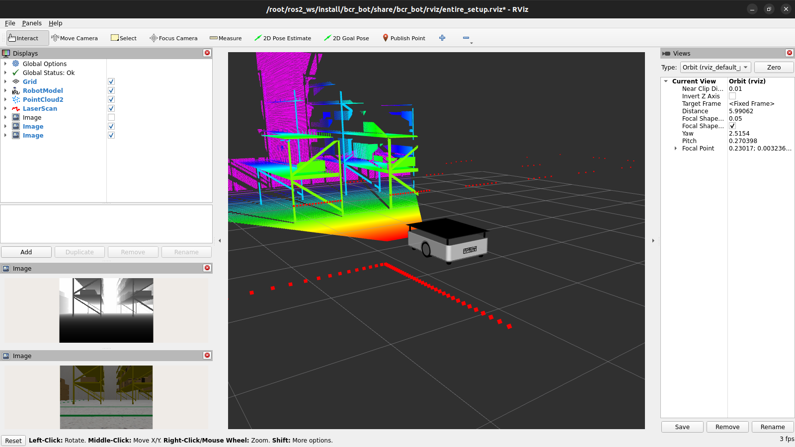

Данный проект содержит, также, стереокамеру. Ниже приведена команда для запуска 

```bash
ros2 launch stereo_image_proc stereo_image_proc.launch.py left_namespace:=bcr_bot/stereo_camera/left right_namespace:=bcr_bot/stereo_camera/right
```

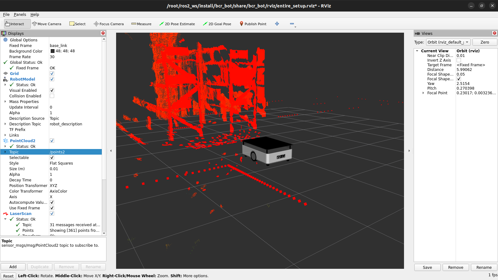

Для просмотра данных с imu сенсора используется команад:
```bash
ros2 topic echo bcr_bot/imu
```

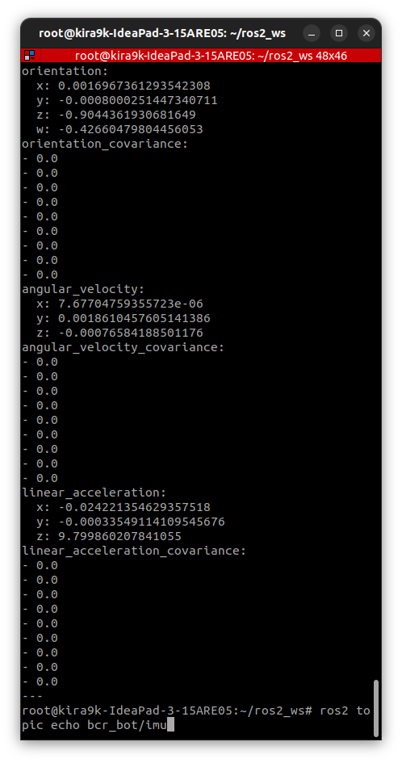

В данном сообщении содержится метка времени, кватернион ориентации, угловая скорость, линейное ускорение и матрицы ковариаций.

### Картографирование с помощью SLAM Toolbox
SLAM Toolbox — это пакет с открытым исходным кодом, предназначенный для картографирования окружающей среды с использованием лазерного сканирования и одометрии, а также для создания карты для автономной навигации.

Чтобы начать картографирование:
```bash
ros2 launch bcr_bot mapping.launch.py
```

Для управления роботом и картографирования местности используется Teleop Twist:

```bash
ros2 run teleop_twist_keyboard teleop_twist_keyboard cmd_vel:=/bcr_bot/cmd_vel
```

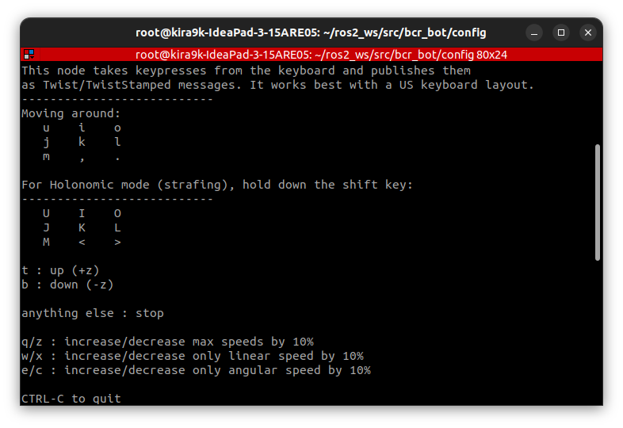

Данный узел позволяет управлять роботом с клавиатуры, считывая нажатия клавиш и публикуя их в виде сообщений ```Twist```. Функциональность представлена в таблице ниже.

Описание параметров:
|Назначение|Клавиши|
|:-------------------------------------------------------|:-------------:|
|Движение вперед/назад                                   |```i```/```,```|
|Поворот налево/направо                                  |```j```/```l```|
|Движение по окружности вперед по часовой/против часовой |```o```/```u```|
|Движение по окружности назад по часовой/против часовой  |```m```/```.```|
|Остановка                                               |```k```        |
|Увеличение/уменьшение угловой и линейной скорости на 10%|```q```/```z```|
|Увеличение/уменьшение только линейной скорости на 10%   |```w```/```x```|
|Увеличение/уменьшение только угловой скорости на 10%    |```e```/```c```|

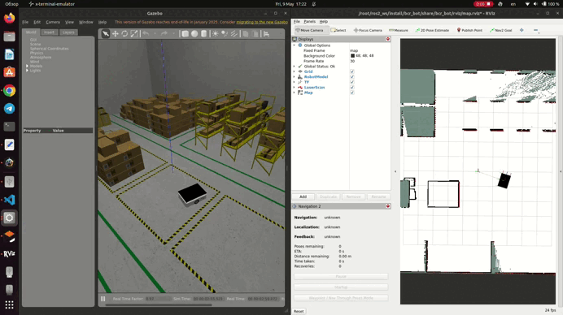

Чтобы сохранить карту:

```bash
cd src/bcr_bot/config
ros2 run nav2_map_server map_saver_cli -f bcr_map
```

Пример сохраненной карты показан ниже.

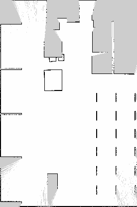

### Использование Nav2 с bcr_bot

Nav2 — это навигационный пакет с открытым исходным кодом, который позволяет роботу легко перемещаться по среде. Он принимает данные лазерного сканирования и одометрии, а также карту среды в качестве входных данных.

Чтобы запустить Nav2 на bcr_bot:
```bash
ros2 launch bcr_bot nav2.launch.py
```

Ве параметры для навигации описаны в файле ```nav2_params.yaml```.

Для локализации робота используется алгоритм AMCL (аддапитвная локализация Монте-Карло). **Локализация Монте-Карло** (MCL) является алгоритмом, чтобы локализовать робота с помощью фильтра частиц. Алгоритм требует известной карты, и задача состоит в том, чтобы оценить положение робота в рамках карты на основе движения и обнаружения робота. Алгоритм запускается с начальной веры вероятностного распределения положения робота, которое представлено частицами, распределенными согласно такой вере. Эти частицы распространены после модели движения робота каждый раз изменения положения робота. После получения новых показаний датчика каждая частица оценит свою точность путем проверки, с какой вероятностью это получило бы такие показания датчика в своем текущем положении. Затем алгоритм перераспределит (передискретизируют) частицы, чтобы сместить частицы, которые более точны. Продолжите выполнять итерации этих перемещение, обнаружение и передискретизация шагов, и все частицы должны сходиться к одному кластеру около истинного положения робота, если локализация успешна [[1]](#список-литературы).

Адаптивная локализация Монте-Карло (AMCL) является вариантом MCL. AMCL динамически настраивает количество частиц на основе KL-расстояния [[2]](#список-литературы), чтобы гарантировать, что распределение частицы сходится к истинному распределению состояния робота на основе всего прошлого датчика и измерений движения с высокой вероятностью.

Для планирования пути используется алгоритм Дейкстры. **Алгоритм Дейкстры** — это классический алгоритм поиска пути, который был разработан голландским ученым Эдсгером Дейкстрой в 1959 году. Этот алгоритм используется для поиска кратчайшего пути в взвешенном графе от одной вершины до всех остальных вершин [[3]](#список-литературы).

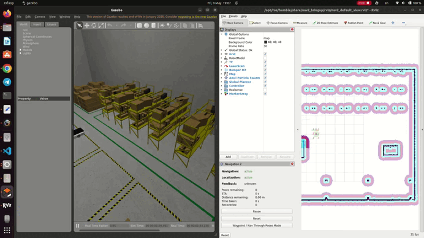

### Добавление скрипта для публикации координат целевой точки

Для того, чтобы задавать координаты целевой точки через командную строку, написал скрипт ```goal_publisher.py```. Класс ```GoalPublisher``` представлен ниже.

```python
class GoalPublisher(Node):
    def __init__(self):
        super().__init__('goal_publisher')
        # Создание паблишера для топика '/goal_pose' 
        self.publisher_ = self.create_publisher(PoseStamped, '/goal_pose', 10)
        self.get_logger().info('Goal Publisher node initialized')

    def publish_goal(self, x, y, z, yaw):
        """
        Метод для публикации цели в топик '/goal_pose'.
        Аргументы:
            x,y,z: координаты целевой точки (в метрах)
            yaw: угол поворота (в радианах)
        """
        time.sleep(1.0) 
        goal_msg = PoseStamped() # Создание сообщения типа PoseStamped
        goal_msg.header.stamp = self.get_clock().now().to_msg() 
        # Установка временной метки
        goal_msg.header.frame_id = 'map' # Установка системы координат

        # Установка координат целевой точки
        goal_msg.pose.position.x = x
        goal_msg.pose.position.y = y
        goal_msg.pose.position.z = z

        # Преборазование угла в кватернион
        goal_msg.pose.orientation.x = 0.0
        goal_msg.pose.orientation.y = 0.0
        goal_msg.pose.orientation.z = math.sin(yaw / 2.0)
        goal_msg.pose.orientation.w = math.cos(yaw / 2.0)

        # Публикация сообщения в топик '/goal_pose'
        self.publisher_.publish(goal_msg)
        self.get_logger().info(
            f'Published goal: x={x}, y={y}, z={z}, yaw={yaw} rad'
        )
```

Команда для запуска показана ниже
```bash
python3 ~/ros2_ws/src/bcr_bot/scripts/goal_publisher.py --x 2.0 --y 1.0 --z 0.0 --yaw 1.57
```
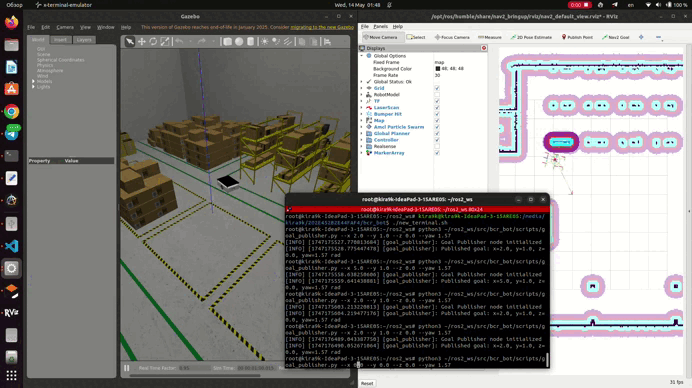

### Эксперимент
#### Постановка эксперимента

В данной работе эксперимент заключался в сравнении точности навигации робота ```bcr_bot``` при использовании двух источников одометрии: ```odometry=world``` и ```odometry=encoder```. Также происходили тесты, когда задвалось начальное положение. Все измерения проводились на карте ```small_warehouse.sdf```, начальная позиция была задана (0,0,0). Эксперимент включал в себя 5 различных целевых точек. В качестве сенсоров использовались лидар, энкодеры, IMU

#### Порядок проведения эксперимента

1. Запуск launch-файла ```gazebo.launch.py``` с тестируемым параметров (```odometry=world``` или ```odometry=encoder```).
2. Запуск launch-файла ```nav2.launch.py```.
3. Запуск скрипта ```goal_publisher.py``` для задания целевой позиции.
4. Ожидание завершения движения робота.
5. Проверка реальной позиции робота из топика ```/bcr_bot/p3d_ground_truth```.
6. Запись данных в таблицу.

#### Результаты эксперимента и выводы

В таблице ниже приведены результаты эксперимента.

|Целевая позиция (x,y)|```world```   |```encoder```|```encoder```+```initial_pose```|
|:-------------------:|:------------:|:-----------:|:------------------------------:|
|(-5.15, 6.9)         |(-5.09, 6.70) |(-4.15, 6.97)|(-5.02, 6.72)                   |
|(-5.5, -8.4)         |(-5.35, -8.22)|(-4.5, -8.16)|(-5.31, -8.00)                  |
|(5.5, -8.0)          |(5.31, -7.90) |(5.6, -7.11) |(5.34, -7.88)                   |
|(1.5, 8.0)           |(1.47, 7.78)  |(1.79, 7.32) |(1.45, 7,79)                    |
|(3.5, 0.0)           |(3.32, 0.00)  |(2.85, 0.00) |(3.34, 0.00)                    |

В таблице ниже представлены несколько метрик для анализа полученного результата.

|Метрика                  |```world```|```encoder```|```encoder```+```initial_pose```|
|:-----------------------:|:---------:|:-----------:|:------------------------------:|
|Средняя ошибка           |0.2114 м   |0.8594 м     |0.2142 м                        |
|Максимальная ошибка по x |0.19 м     |1 м          |0.19 м                          |
|Максимальная ошибка по y |0.22 м     |0.89 м       |0.22 м                          |
|Стандатрное отклонение   |0.019 м    |0.165 м      |0.021 м                         |

Для ```odometry=world``` небольшие ошибки. Это связано с параметром ```xy_goal_tolerance: 0.25```. Данный параметр означает, что робот останавливается в радиусе 25см от цели. Также, при данной одометрии маленький разброс и небольшие максимальные ошибки.

Для ```odometry=encoder``` ошибки значительно выше. Это может быть связано с скольжением колес, неточностями модели движения и недостаточной коррекцией AMCL. 

```odometry=encoder+initial_pose``` существенно улучшает результат (0.2142 м). Это означает, что задание начальное позиции помогает AMCL лучше оценивать смещения. 

Таким образом, использование ```initial_pose``` с энкодерами позволяет достичь точности, близкой к идеальной одометрии, что делеает метод применимым в реальных условиях.

## Заключение


В рамках курсовой работы был изучен и запущен проект навигации [bcr_bot](<https://github.com/blackcoffeerobotics/bcr_bot>), включающий локализацию, планирование пути и обработку данных сенсоров. Также, был проведен эксперимент по сравнению точности навигации с двумя источниками одометрии (```odometry=world``` и ```odometry=encoder```) показал, что использование истинных данных Gazebo обеспечивает высокую точность (средняя ошибка 0.211 м), тогда как энкодеры колес демонстрируют значительный дрейф (средняя ошибка 0.860 м). При задачании начальной позици реузльтат значительно улучшается и становится близким к ```odometry=world``` 

Для изоляции и воспроизводимости проекта использовался Docker. 

Из приемуществ в данной работе хотелось бы отметить открытый исходный код, готовые решения для планирования и навигации, много настраиваемых параметров и аргументов и хорошее оформление файлов моделей и конфигурационных файлов. 

## Благодарности
Особая благодарность [Black Coffee Robotics](<https://github.com/blackcoffeerobotics>) за разработку репозитория [bcr_bot](<https://github.com/blackcoffeerobotics/bcr_bot>), который послужил основой для данной работы. Код использован в соответствии с [Apache License 2.0](http://www.apache.org/licenses/LICENSE-2.0). Спасибо за ценный вклад в мое обучение!

## Список литературы
[1] Локализация TurtleBot с использованием метода Монте-Карло // Exponenta Docs. — URL: https://docs.exponenta.ru/nav/ug/localize-turtlebot-using-monte-carlo-localization.html (дата обращения: 09.05.2025).

[2] С. Трун, В. Бергард и Д. Фокс, вероятностная робототехника. Кембридж, MA: нажатие MIT, 2005.

[3] ROS 2 для начинающих: от установки до создания робота // Habr. — URL: https://habr.com/ru/companies/otus/articles/748470/ (дата обращения: 09.05.2025).